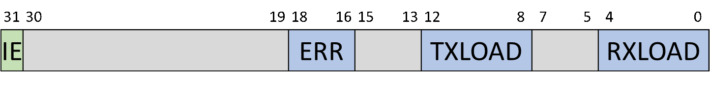
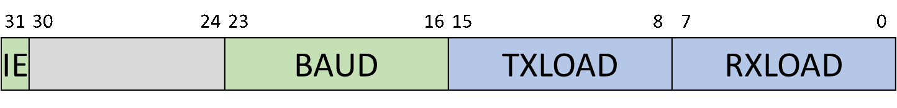
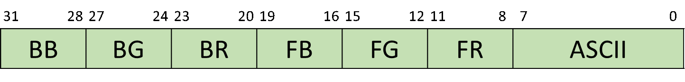
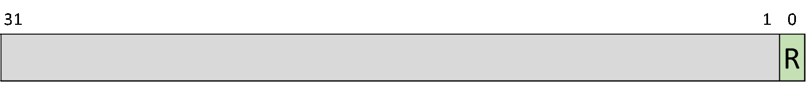

# Peripherals reference manual

This document contains description on the function, format, and address of all peripheral control registers in the SoC.

Addresses are shown in virtual address space. Blue-shaded bits or fields are read-only; green-shaded bits or fields are readable and writable; gray-shaded bits or fields are reserved or unused, reading returns zeros while writing is ignored by hardware.

All register fields reset as 0 unless otherwise noted.

### 1. Basic I/O

#### 1.1 Switch : 0xBFC09000

* SW: Status of the slide-switches. 0 for the 'down' position, 1 for the 'up' position.

#### 1.2 Button : 0xBFC09004

* V: Valid bit. 1 means one and only one button is pressed down, 0 otherwise.
* X, Y: Encoded position of the pressed button. Valid ranges are both 0 to 4(inclusive). These fields are valid only when the V bit is set.

#### 1.3 Seven-segment display : 0xBFC09008

* SEG: The value to be displayed on the 7-seg. This value will be displayed as eight hexadecimal digits.

#### 1.4 LED : 0xBFC0900C

* LED: Controls the state of individual LEDs. 1 for on, 0 for off.

### 2. PS/2 and UART

#### 2.1 PS/2 data register : 0xBFC09010

* DATA: Data buffer. Writing to this address will append this field to the transmit buffer, while reading from this address will return the next available byte from the receive buffer.

#### 2.2 PS/2 control register : 0xBFC09014

* IE: Interrupt enable. Setting this bit to 1 will enable interrupts on receiving data.
* ERR: Error code. Possible values include:
  0: no error, receive/transmit completed normally;
  4: timeout in receiving;
  5: parity error in receiving;
  6: timeout in transmitting;
  7: no acknowledgment received after transmitting.
* TXLOAD: Transmit buffer usage. 0 for empty, 31 for full.
* RXLOAD: Receive buffer usage. 0 for empty, 31 for full.

#### 2.3 UART data register : 0xBFC09018

* DATA: Data buffer. Writing to this address will append this field to the transmit buffer, while reading from this address will return the next available byte from the receive buffer.

#### 2.4 UART control register : 0xBFC0901C

* IE: Interrupt enable. Setting this bit to 1 will enable interrupts on receiving data.
* BAUD: Baud rate divider. Baud rate of the UART is determined by $230400\over{BAUD+1}$.
* TXLOAD: Transmit buffer usage. 0 for empty, 255 for full.
* RXLOAD: Receive buffer usage. 0 for empty, 255 for full.

### 3 VGA

#### 3.1 Character-mode VRAM : 0xBFC04000 - 0xBFC07FFF

* BB, BG, BR: Blue, green, and red component of background color.
* FB, FG, FR: Blue, green, and red component of font color.
* ASCII: ASCII code of the displayed character.

#### 3.2 Cursor control register : 0xBFC09020

* FREQ: Frequency of cursor blinking. The cursor blinks $32\over{FREQ+1}$ times in one second. Setting to 0 turns of the cursor.
* X, Y: Position of the cursor, measured in characters starting from the top-left corner.

### 4 SD

#### 4.1 Argument register : 0xBFC09100

* ARG: Command argument. Write operation to this register triggers command transaction; Command register should be configured before writing to this register.

#### 4.2 Command register : 0xBFC09104

* CMD: Command index. Refer to SD card specifications for a list of valid commands.
* D: Data transaction setting. 0 for no data transaction; 1 for read transaction; 2 for write transaction. Data transactions happen after command transactions.
* I: Check response for command index.
* C: Check response CRC.
* B: Check for SD card busy signal after command transaction.
* R: Response setting. 0 for no response, 1 for short response (R1, R1b, R3, R6-type response), 2 for long response (R2-type response).

#### 4.3 Response register 0-3 : 0xBFC09108 - 0xBFC09114

* RESP: Response data bits, excluding start/stop bits, CRC, and command index.

For short response, valid response bits are bits 31..0 in Response register 0.

For long response, valid response bits are bits 23..0 in Response register 3 and all bits in Response register 0-2.

#### 4.4 Data transfer timeout register : 0xBFC09118

* TIMEOUT: Data timeout transfer value, measured in SD clock cycles. Setting to 0 disables data transfer timeout. Timeout value can be calculated from following formula:

$$
\$TIMEOUT=\frac{timout[s]*f_{sd\_clk}[Hz]}{\$clkdiv+1}
$$

#### 4.5 Bus mode register : 0xBFC0911C

* M: SD data bus mode; 0 for 1-bit data bus, 1 for 4-bit data bus.

Note that this register only controls SD card controller behavior. SD cards boot with 1-bit data bus, and in order to switch to 4-bit data bus, one should send a sequence of commands to SD card. Refer to SD card specifications for more information.

#### 4.6 Command transfer timeout register : 0xBFC09120

- TIMEOUT: Command timeout transfer value, measured in SD clock cycles. Setting to 0 disables command transfer timeout. Timeout value can be calculated from following formula:

$$
\$TIMEOUT=\frac{timout[s]*f_{sd\_clk}[Hz]}{\$clkdiv+1}
$$

#### 4.7 Clock divider register : 0xBFC09124 

* DIV: Clock divider value. Input clock is divided by $$\$DIV+1$$, then routed to SD card clock pin. This field resets as 0xFF.

#### 4.8 Software reset register : 0xBFC09128

* R: Software reset control/status. Writing 1 to this bit triggers reset progress; when reset completes, this bits automatically resets to 0.

#### 4.9 Voltage information register : 0xBFC0912C

* VOLTAGE: SD card supply voltage, measured in mV. Value of this register is currently hard-coded in RTL code.

#### 4.10 Command interrupt status register : 0xBFC09134

This register holds interrupt flags related to command transaction. Writing any value to this register clears all flags.

* I: Index error; response index does not match command index.
* C: CRC error.
* T: Timeout.
* E: Error; if any of the three flags is set, this bit is set.
* S: Success.

#### 4.11 Command interrupt mask register : 0xBFC09138

This register masks command transaction interrupts. Disabled interrupt events will not generate interrupt signal, but will still have their flags in Command interrupt status register set.

#### 4.12 Data interrupt status register : 0xBFC0913C

This register holds interrupt flags related to data transaction. Writing any value to this register clears all flags.

* T: Timeout.
* F: Frame error; start bit is not 0 or stop bit is not 1.
* U: Underflow error, transmit FIFO underflow, mostly caused by wishbone DMA interface being blocked for too long.
* O: Overflow error, receive FIFO overflow, mostly caused by wishbone DMA interface being blocked for too long.
* C: CRC error.
* E: Error; if any of the five flags is set, this bit is set.
* S: Success.

#### 4.13 Data interrupt mask register : 0xBFC09140

This register masks data transaction interrupts. Disabled interrupt events will not generate interrupt signal, but will still have their flags in Data interrupt status register set.

#### 4.14 Block size register : 0xBFC09144

* SIZE: Data block size minus 1, measured in bytes. This field resets as 511.

#### 4.15 Block count register : 0xBFC09148

* COUNT: Data block count minus 1.

#### 4.16 DMA address register : 0xBFC09160

* ADDR: Initial address of DMA operation. Must be aligned to 4-byte boundary.

This register should be configured if DMA is used; however, in our implementation the DMA function is not used, and the DMA interface is connected to a dedicated buffer, so this register should be programmed with zero.

The buffer is mapped to address range 0xBFC08000 - 0xBFC08FFF.

### 5. Summary

#### 5.1 Registers

| Address    | Description                 |
| ---------- | --------------------------- |
| 0xBFC09000 | Switch                      |
| 0xBFC09004 | Button                      |
| 0xBFC09008 | 7-segment display           |
| 0xBFC0900C | LED                         |
| 0xBFC09010 | PS/2 data register          |
| 0xBFC09014 | PS/2 control register       |
| 0xBFC09018 | UART data register          |
| 0xBFC0901C | UART control register       |
| 0xBFC09020 | VGA cursor control          |
| 0xBFC09100 | SD argument register        |
| 0xBFC09104 | SD command register         |
| 0xBFC09108 | SD response register 0      |
| 0xBFC0910C | SD response register 1      |
| 0xBFC09110 | SD response register 2      |
| 0xBFC09114 | SD response register 3      |
| 0xBFC09118 | SD data timeout register    |
| 0xBFC0911C | SD bus mode register        |
| 0xBFC09120 | SD command timeout register |
| 0xBFC09124 | SD clock divider register   |
| 0xBFC09128 | SD software reset register  |
| 0xBFC0912C | SD voltage register         |
| 0xBFC09134 | SD command interrupt status |
| 0xBFC09138 | SD command interrupt mask   |
| 0xBFC0913C | SD data interrupt status    |
| 0xBFC09140 | SD data interrupt mask      |
| 0xBFC09144 | SD block size register      |
| 0xBFC09148 | SD block count register     |
| 0xBFC09160 | SD DMA address register     |

#### 5.2 Memory

| Start address | End address | Size | Description         |
| ------------- | ----------- | ---- | ------------------- |
| 0xBFC00000    | 0xBFC03FFF  | 16K  | Bootloader          |
| 0xBFC04000    | 0xBFC07FFF  | 16K  | Character-mode VRAM |
| 0xBFC08000    | 0xBFC08FFF  | 4K   | SD data buffer      |

