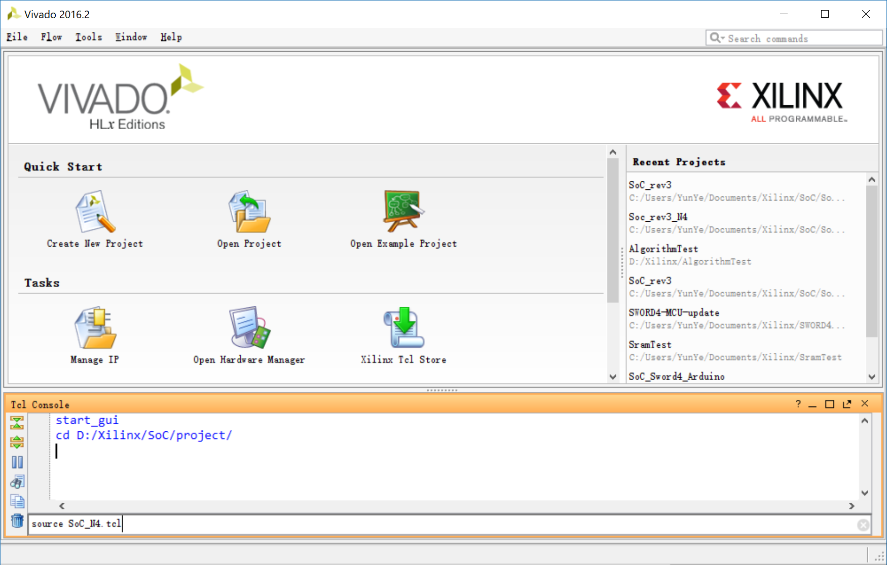

# ZJUNIX-SoC

A simple System-on-Chip built on an FPGA, originally targeted at Zhejiang University's SWORD4 FPGA experiment platform. It is designed to support simple operating systems developed by students; the first operating system running on this SoC is [ZJUNIX](https://github.com/ZJUNIX/ZJUNIX).

Detailed documentation is currently in progress; a general description is provided in doc/SoC.md.

# Lisence

[BSD-3-Clause](./LICENSE)

# Creating the project

Follow these steps to create the SoC project from this repository:

1. Launch Vivado and open the TCL console.

2. Navigate to the ```project``` directory with the ```cd``` command.
   Note: The path to this directory should not contain spaces or non-ascii characters

3. Run the following TCL commands (substitute \<platform\>  with the target platform; currently N4DDR and SWORD4 are supported).

   ```tcl
   set project_platform <platform>
   source SoC.tcl
   ```


Example:



# Updating file set

The script ```fileset.tcl``` contains lists of design sources for different platforms. ```rtl_common``` and ```header_common``` record shared RTL sources and verilog headers, respectively. ```rtl_<platform>``` and ```constr_<platform>``` record RTL sources(including IP cores) and constraints for \<platform\>. ```constr_<platform>_target``` specifies the target constraint file for \<platform\>. When adding/removing source files to/from the project, these variables should be modified accordingly.

